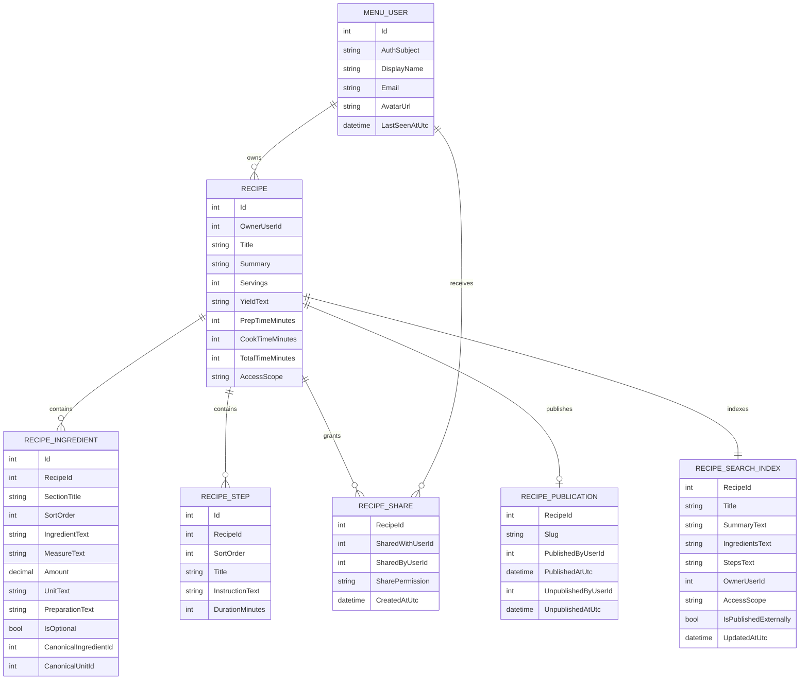
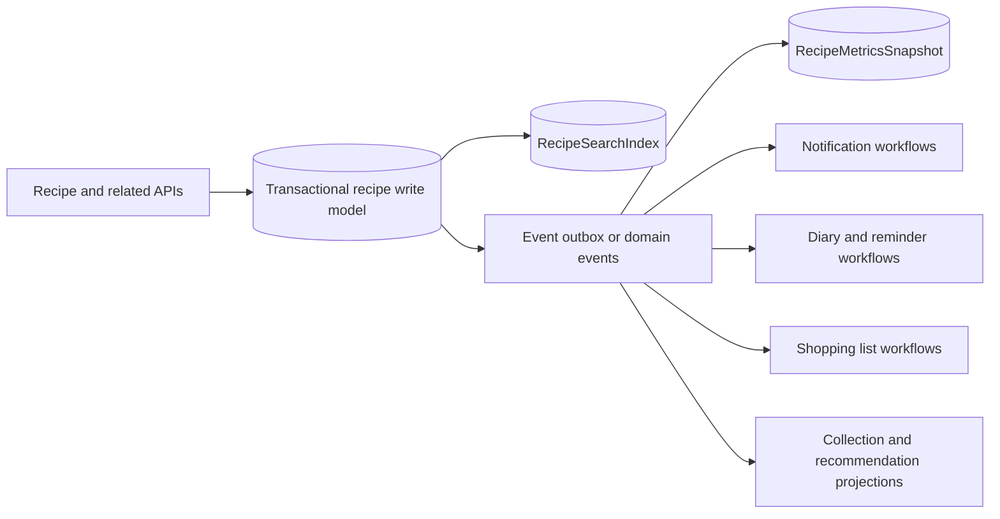
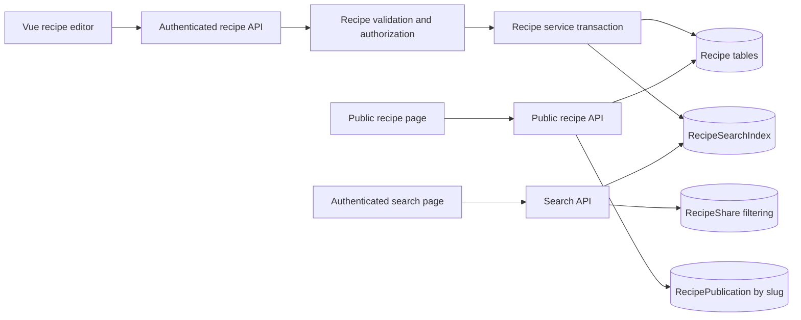

# Recipe Creation Target Architecture

**Status:** Draft  
**Created:** 2026-05-27

## Purpose

This document defines the target architecture for creating, storing, searching, and displaying recipes in the Menu app.

It is intentionally focused on architecture rather than delivery sequencing. It describes:

- the current state of the Menu app
- the target data model for recipes
- the frontend, API, and database changes required to support that model
- the search architecture for recipe title, ingredients, and recipe content
- the display-oriented data that should exist if recipes are to be useful inside the app and on curated public pages

## Constraints and clarified assumptions

The target architecture is based on the following confirmed constraints:

1. Search may stay inside the current stack unless there is a strong reason to introduce an external search service.
2. Recipes must support:
   - private owner-only access
   - sharing to specific users
   - visibility to authenticated Menu users
   - an administrator-curated subset that can be exposed publicly on the internet
3. A single current version of a recipe is sufficient for now. Drafts and revision history are not required in this target architecture.
4. The markdown output belongs in `docs/specs/`.

## Current-state investigation

### Frontend today

The current frontend recipe flow is minimal:

- `ui/menu-website/src/pages/NewRecipe.vue` renders only `new-recipe-form.vue`
- `new-recipe-form.vue` currently contains only the recipe name field
- `RecipeList.vue` displays only recipe names
- there is no recipe detail page
- there is no search UI
- there is no UI for ingredients, steps, visibility, sharing, or publication

The frontend already has the right technical foundations for growth:

- generated OpenAPI types
- `recipe-api.ts` for HTTP calls
- `recipe-service.ts` for Vue Query hooks
- authenticated routing via Auth0

That means the target architecture should extend the existing service pattern rather than replace it.

### API today

The backend already has a basic recipe write path:

- `GET /api/recipe`
- `GET /api/recipe/{recipeId}`
- `GET /api/recipe/{recipeId}/ingredient`
- `POST /api/recipe`
- `PUT /api/recipe/{recipeId}`

The current API supports only:

- recipe name
- a list of recipe ingredients

It does **not** support:

- recipe ownership
- user sharing
- authenticated-user-wide visibility
- public publication
- steps or instructions
- search
- rich display metadata such as summary, servings, yield, and timings

All current API routes are mapped inside:

```csharp
var api = app.MapGroup("/api")
    .RequireAuthorization();
```

That means truly public recipe pages are impossible with the current route topology. A public route group must exist outside the authenticated API group.

### Database today

The current recipe schema is intentionally small:

- `Recipe`
  - `Id`
  - `Name`
- `RecipeIngredient`
  - `RecipeId`
  - `IngredientId`
  - `UnitId`
  - `Amount`

Important current limitations:

1. `Recipe` has a global unique index on `Name`.
2. `RecipeIngredient` is a join table, not recipe-owned content.
3. There is no user table.
4. There is no recipe step table.
5. There is no search projection or full-text index.
6. There is no publication table or slug.

## Architectural decisions

### 1. Keep the core recipe write model relational

The recipe aggregate has a stable structure and must support:

- ordered ingredients
- ordered steps
- ownership and sharing rules
- display metadata
- access-controlled querying
- search indexing

That makes a relational write model the right fit.

A JSON-first design was considered and rejected. SQL Server JSON support is useful when the shape is truly flexible, but recipes in Menu have a clear structure and need normal relational integrity.

### 2. Use SQL Server full-text search first

The target architecture should use SQL Server full-text search rather than add an external search engine initially.

This is the right fit because:

- SQL Server is already in the stack
- the search problem is bounded and well understood
- Microsoft documentation supports multi-column full-text indexes, ranking, stoplists, thesaurus support, and linguistic matching
- EF Core 10 can support the required full-text catalog and index creation through raw SQL in migrations

Important implementation note:

- model-based full-text configuration arrives in EF Core 11
- this repository is currently on EF Core `10.0.8`
- therefore, full-text catalog and index creation should be treated as migration SQL, not normal `OnModelCreating` configuration

### 3. Use a dedicated search projection

Search must cover data that lives across multiple write-model tables:

- recipe title
- recipe ingredient text
- recipe steps and instruction text

Searching directly across joined transactional tables is possible but awkward and brittle for ranking. The target architecture should therefore introduce a dedicated denormalized search table:

- `RecipeSearchIndex`

This table is not the source of truth for recipes. It is a read model maintained from the recipe aggregate.

### 4. Separate ownership, sharing, authenticated visibility, and internet publication

These are different concerns and should not be collapsed into a single field.

The target architecture should separate them like this:

- recipe ownership: who owns the recipe
- authenticated visibility: whether all signed-in Menu users may view it
- explicit sharing: which specific users have access to a private recipe
- public publication: whether an administrator has curated it for public internet access

This avoids overloaded state such as `Private`, `Shared`, `Public`, `Published`, and `Approved` all being encoded into one enum.

### 5. Make recipe ingredients recipe-owned content

The current ingredient model forces recipes to reference only pre-existing canonical ingredients and units. That is too restrictive for real recipe authoring.

The target architecture should treat each recipe ingredient row as recipe-owned content first, with optional links to canonical reference data second.

That means:

- the text the author entered must be preservable
- the ingredient line must remain displayable even if no canonical match exists
- canonical ingredient and unit links are enrichment, not the primary stored representation

### 6. Use `Recipe.Title` for the authored recipe heading

The current codebase uses `Recipe.Name`, but the target architecture should rename the main authored recipe field to `Recipe.Title`.

Reasons:

- recipes are authored content, and `Title` makes that role explicit
- the recipe heading should be distinguishable from canonical reference data such as `Ingredient.Name` and `Unit.Name`
- this gives the future model a clearer distinction between authored content and canonical vocabulary

The target architecture should still keep:

- `Ingredient.Name`
- `Unit.Name`

For public structured-data output, the system can still emit schema.org's `name` property from the internal `Title` field.

The same `Title` pattern should be used consistently for other authored-content entities in this model, such as `RecipeStep.Title` and `RecipeCollection.Title`.

### 7. Use Unicode text for recipe-authored content

The existing schema uses `varchar` widely, but recipe-authored content should be treated as multilingual user-generated text.

For recipe-authored fields, the target architecture should prefer Unicode-capable SQL types:

- `nvarchar(...)`
- `nvarchar(max)` where appropriate

This matters for:

- international recipe titles
- accented ingredient names
- multilingual instruction text
- future public web pages
- full-text search language handling

## Naming decisions

| Concern | Target naming | Why |
|---|---|---|
| Local app user record | `MenuUser` | Avoids collision with common ASP.NET Identity names such as `AppUser` |
| Main recipe field | `Title` | Better reflects authored content while still allowing schema.org `name` output |
| Authenticated recipe visibility | `AccessScope` with `Private` / `AuthenticatedUsers` | Clear and narrow; does not overload sharing or public publication |
| Explicit shares | `RecipeShare` | Direct and consistent with the domain |
| Share capability | `SharePermission` | Avoids confusion with Auth0 or ASP.NET auth roles |
| Public internet publication | `RecipePublication` | Separate editorial/public concern |
| Search read model | `RecipeSearchIndex` | Clear and practical; avoids CQRS-heavy terminology |
| Search projection recipe heading | `Title` | Keeps search and aggregate field naming aligned |
| Ordered instructions | `RecipeStep` | Clear and domain-correct |
| Recipe ingredient free text | `IngredientText` | Distinguishes authored ingredient text from canonical references |
| Ingredient display measure | `MeasureText` | Makes the display/search source explicit |
| Numeric ingredient amount | `Amount` | Matches current codebase and Vogen naming |
| Ingredient grouping | `SectionTitle` | Simple, display-oriented grouping name |

## Target domain model

> **Note:** The ERD below shows the key fields and relationships only. The detailed field tables that follow are the authoritative source for the target schema.



## Target database structure

### `MenuUser`

`MenuUser` is the local application identity record that connects Auth0 users to recipe ownership and sharing.

| Field | Notes |
|---|---|
| `Id` | Internal primary key |
| `AuthSubject` | Unique Auth0 `sub` value |
| `DisplayName` | Cached display name for UI and sharing |
| `Email` | Nullable if not available from Auth0 |
| `AvatarUrl` | Nullable UI convenience field |
| `CreatedAtUtc` | Audit |
| `LastSeenAtUtc` | Useful for user lookup and admin tools |

### `Recipe`

`Recipe` is the aggregate root.

| Field | Required | Notes |
|---|---|---|
| `Id` | Yes | Primary key |
| `OwnerUserId` | Yes | FK to `MenuUser` |
| `Title` | Yes | Main recipe title; unique per owner |
| `Summary` | No | Short description for cards, snippets, and public pages |
| `Servings` | No | Structured count when the recipe serves a known number of people |
| `YieldText` | No | Human-readable output such as `1 loaf` or `24 cookies` |
| `PrepTimeMinutes` | No | Preparation time |
| `CookTimeMinutes` | No | Cooking time |
| `TotalTimeMinutes` | No | Needed because total time is not always `prep + cook` |
| `AccessScope` | Yes | `Private` or `AuthenticatedUsers` |
| `CreatedAtUtc` | Yes | Audit |
| `UpdatedAtUtc` | Yes | Audit and cache invalidation |

Key constraints:

- replace the current global recipe-name uniqueness rule with title uniqueness per owner
- authenticated visibility and external publication are **not** the same thing

Recommended database rules:

- unique index on `(OwnerUserId, Title)`
- bounded `Title`
- Unicode storage for authored text

### `RecipeIngredient`

`RecipeIngredient` is no longer a pure join table. It becomes authored recipe content.

| Field | Required | Notes |
|---|---|---|
| `Id` | Yes | Surrogate PK; the current composite PK is no longer suitable |
| `RecipeId` | Yes | FK to `Recipe` |
| `SectionTitle` | No | Groups ingredient lines such as `For the sauce` |
| `SortOrder` | Yes | Preserves ingredient order |
| `IngredientText` | Yes | Authored ingredient text such as `olive oil` |
| `MeasureText` | Yes | Display/search source of truth such as `1 tbsp`, `1-2 tbsp`, or `to taste` |
| `Amount` | No | Optional structured numeric amount when parseable |
| `UnitText` | No | Optional structured unit when parseable |
| `PreparationText` | No | Extra text such as `finely chopped` |
| `IsOptional` | Yes | Supports optional ingredients |
| `CanonicalIngredientId` | No | Optional FK to the canonical ingredient catalog |
| `CanonicalUnitId` | No | Optional FK to the canonical unit catalog |

Important rule:

- `MeasureText` is always the display and search source
- `Amount` and `UnitText` are structured helpers when the measure is parseable
- if structured values exist, they must describe the same measure that `MeasureText` represents

This is the best compromise between:

- preserving author intent
- supporting a good create/edit UX
- keeping a path open for future scaling, filtering, or nutrition logic

### `RecipeStep`

`RecipeStep` stores the ordered method for the recipe.

| Field | Required | Notes |
|---|---|---|
| `Id` | Yes | Surrogate PK |
| `RecipeId` | Yes | FK to `Recipe` |
| `SortOrder` | Yes | Preserves step order |
| `Title` | No | Useful for grouped methods such as `Make the sauce` |
| `InstructionText` | Yes | Full step content |
| `DurationMinutes` | No | Optional structured duration for the step |

The search requirement for recipe content should treat `InstructionText` as the main searchable method content.

### `RecipeShare`

`RecipeShare` grants explicit access to a private recipe.

| Field | Required | Notes |
|---|---|---|
| `RecipeId` | Yes | FK to `Recipe` |
| `SharedWithUserId` | Yes | FK to `MenuUser` |
| `SharedByUserId` | Yes | FK to `MenuUser` |
| `SharePermission` | Yes | Start with `Viewer`; keep room for future expansion |
| `CreatedAtUtc` | Yes | Audit |

Key rule:

- primary key should be `(RecipeId, SharedWithUserId)`

State rule:

- sharing is meaningful primarily for `Private` recipes
- a private recipe with share rows is the shared state
- `AuthenticatedUsers` recipes do not need share rows for ordinary read access

### `RecipePublication`

`RecipePublication` is the admin-controlled record that makes a recipe internet-visible.

| Field | Required | Notes |
|---|---|---|
| `RecipeId` | Yes | FK to `Recipe` |
| `Slug` | Yes | Stable public route identifier |
| `PublishedByUserId` | Yes | Admin who curated the recipe |
| `PublishedAtUtc` | Yes | When it became public |
| `UnpublishedByUserId` | No | Admin who removed public visibility |
| `UnpublishedAtUtc` | No | Null means currently published |

Important rules:

- at most one `RecipePublication` row exists per recipe
- unpublishing sets `UnpublishedAtUtc` and `UnpublishedByUserId` on that row
- re-publishing reactivates the same row by clearing the unpublish fields and updating the publication audit fields
- `Slug` must be globally unique among active public publications
- the slug belongs on `RecipePublication`, not on `Recipe`
- the public page should resolve only active publications where `UnpublishedAtUtc IS NULL`
- this row tracks the current publication state rather than a full publication-history log

Slug rules:

- the slug is generated when a recipe is first published
- it should be lowercase and URL-safe
- it should be bounded to a sensible public URL length
- if the natural slug is already taken, a disambiguating suffix should be added
- a recipe title change does **not** automatically change the public slug; public URLs should stay stable once published

### `RecipeSearchIndex`

`RecipeSearchIndex` is a denormalized, one-row-per-recipe read model.

| Field | Required | Notes |
|---|---|---|
| `RecipeId` | Yes | PK and FK to `Recipe` |
| `Title` | Yes | Recipe title for weighted search |
| `SummaryText` | No | Optional summary/snippet field |
| `IngredientsText` | Yes | Concatenated ingredient lines |
| `StepsText` | Yes | Concatenated step text |
| `OwnerUserId` | Yes | Supports ownership filtering |
| `AccessScope` | Yes | Supports broad access filtering |
| `IsPublishedExternally` | Yes | Supports public search/read filtering |
| `UpdatedAtUtc` | Yes | Search freshness and debugging |

Search rules:

1. Full-text index `Title`, `IngredientsText`, `StepsText`, and optionally `SummaryText`.
2. Update `RecipeSearchIndex` in the same transaction as recipe writes.
3. Authenticated search may still join to `RecipeShare` to include shared private recipes.
4. If that join becomes a bottleneck later, a mirrored share-search table can be added without replacing the overall architecture.

## Search architecture

Microsoft SQL Server full-text search is the preferred initial search engine for this architecture.

Reasons:

- it supports weighted multi-column search
- it supports ranking
- it supports linguistic matching
- it supports stoplists and thesaurus entries
- it keeps operational complexity low

### Searchable sources

The target architecture should search these fields:

| Search intent | Source |
|---|---|
| Recipe title | `RecipeSearchIndex.Title` |
| Ingredients | `RecipeSearchIndex.IngredientsText` |
| Recipe content / method | `RecipeSearchIndex.StepsText` |
| Optional summary text | `RecipeSearchIndex.SummaryText` |

### Search query behavior

Recommended initial behavior:

1. Use full-text ranking for user-entered search text.
2. Weight recipe title matches above ingredient and step matches.
3. Return snippets from summary or matched step text where practical.
4. Filter by access before returning results:
   - owner
   - shared-with-user
   - authenticated-user-visible
   - externally published when using the public route

### Search projection update path

The search index should be rebuilt for a recipe inside the same application-layer transaction that writes:

- the recipe root
- the ingredient rows
- the step rows

This keeps the relational search projection row consistent with the recipe aggregate and avoids trigger-based hidden behavior.

Additional sync rules:

- rebuild the search projection when `Recipe.AccessScope` changes
- rebuild the search projection when a `RecipePublication` row is published or unpublished

Important consistency note:

- the relational `RecipeSearchIndex` row is updated synchronously inside the transaction
- SQL Server full-text population is still asynchronous after commit
- that means full-text query results may be briefly stale immediately after a recipe write or publication change
- this is acceptable for recipe search, but it should not be treated as a strict transactional read-your-writes guarantee

### Migration note

Because the repository is on EF Core 10, the full-text setup should be created in migrations using raw SQL such as:

- full-text catalog creation
- full-text index creation on `RecipeSearchIndex`

That decision follows Microsoft guidance for older EF Core versions.

## Access and publication model

The target visibility model is:

| Scenario | Mechanism |
|---|---|
| Owner-only recipe | `AccessScope = Private`, no relevant `RecipeShare` row |
| Shared private recipe | `AccessScope = Private` plus `RecipeShare` row(s) |
| Visible to all signed-in Menu users | `AccessScope = AuthenticatedUsers` |
| Public on the internet | active `RecipePublication` row |

This matters because "visible to authenticated users" and "public on the internet" are not the same audience.

### Admin publication control

Publication requires a separate authorization rule from ordinary recipe ownership.

The architecture therefore needs:

- an Auth0 permission dedicated to publication administration
- a matching ASP.NET authorization policy
- admin-only publication endpoints

Without this, the architecture would not safely support curated public recipes.

Recommended authorization contract:

- Auth0 permission: `recipe:publish`
- ASP.NET policy checks that permission claim before allowing publication changes

## User provisioning model

The architecture depends on `MenuUser`, so the provisioning seam must be explicit.

Recommended approach:

1. On authenticated recipe writes, resolve the Auth0 `sub` claim.
2. Ensure a `MenuUser` row exists for that subject.
3. Perform this inside the same resilient application transaction as the recipe write.

This avoids:

- dangling ownership references
- first-write race conditions
- recipe rows that cannot be linked to a local user record

## Related recipe usage capabilities

The following capabilities sit adjacent to recipe creation, but they materially affect the target architecture because they depend on the recipe model and influence which related records, read models, and events should exist.

### Metrics and engagement

Recipe usage metrics should be modeled as read-side projection data, not as mutable counters on `Recipe`.

Recommended projection:

- `RecipeMetricsSnapshot`

| Field | Notes |
|---|---|
| `RecipeId` | FK to `Recipe` |
| `PublicViewCount` | Views from unauthenticated traffic |
| `AuthenticatedViewCount` | Views from signed-in users |
| `FavoriteCount` | Derived from `RecipeFavorite` |
| `PlannedCount` | Derived from planned diary entries |
| `CookedCount` | Derived from cooked diary entries |
| `LastViewedAtUtc` | Optional recency signal |
| `LastCookedAtUtc` | Optional recency signal |

Important rules:

- these values should be projection data, not write-model columns on `Recipe`
- segmented view counts should be derived from view events, not maintained by direct request-time increments on the recipe row
- view events must carry enough context to distinguish authenticated and unauthenticated traffic, either via an auth flag or separate event types
- `CookedCount` should derive from diary entries marked as cooked, so there is only one source of truth for recipe usage history

### Favourites

Code identifiers in this section intentionally use American spelling, for example `RecipeFavorite`.

Users should be able to add visible recipes to a favourites list.

Recommended record:

- `RecipeFavorite`

| Field | Notes |
|---|---|
| `UserId` | FK to `MenuUser` |
| `RecipeId` | FK to `Recipe` |
| `CreatedAtUtc` | Audit and ordering |

Recommended rule:

- unique key on `(UserId, RecipeId)`

This keeps favourites as an explicit user capability and makes favourite count derivable from real user records.

### Recipe diary

Users should be able to keep both:

- future planned recipe usage
- historical cooked recipe usage

Recommended record:

- `RecipeDiaryEntry`

| Field | Notes |
|---|---|
| `Id` | Primary key |
| `UserId` | FK to `MenuUser` |
| `RecipeId` | FK to `Recipe` |
| `EntryStatus` | `Planned`, `Cooked`, or another lifecycle status as the diary evolves |
| `PlannedForDate` | Nullable planning date |
| `OccurredAtUtc` | When the cook or diary event happened |
| `Notes` | Optional user notes |
| `CreatedAtUtc` | Audit |

Important rule:

- historical cooked diary entries are the source of truth for cooked-count metrics

### Shopping list integration boundary

Shopping lists are large enough to justify their own architecture document, but the recipe architecture should still prepare for them.

Recommended boundary:

- shopping list generation should accept a normalized recipe selection set from either:
  - diary-planned recipes
  - an ad hoc user selection of recipes

This allows both workflows without forcing two separate shopping-list subsystems. The current recipe architecture should preserve enough ingredient structure to support later list generation, merging, and normalization work.

### Curated recipe collections

Curated themed sets of recipes should be supported as an adjacent capability.

Recommended records:

- `RecipeCollection`
- `RecipeCollectionItem`

Suggested collection fields:

| Field | Notes |
|---|---|
| `Id` | Primary key |
| `Title` | Collection title |
| `Summary` | Short thematic description |
| `CreatedByUserId` | Editor or admin owner |
| `IsCurated` | Distinguishes editorial sets from broader future collection types |
| `CreatedAtUtc` | Audit |

Suggested collection-item fields:

| Field | Notes |
|---|---|
| `CollectionId` | FK to `RecipeCollection` |
| `RecipeId` | FK to `Recipe` |
| `SortOrder` | Ordering within the collection |

Important rules:

- a recipe should be able to appear in multiple collections
- the initial focus should be in-app thematic browsing and diary assignment
- the model should still leave room for later public publication of curated collections without forcing that into the first implementation

### Communication preferences

Publication-triggered emails and similar communications should be controlled by user-level preferences, not by recipe fields.

Recommended record:

- `MenuUserCommunicationPreference`

Suggested fields:

| Field | Notes |
|---|---|
| `UserId` | FK to `MenuUser` |
| `Category` | Named communication category |
| `IsOptedIn` | Permission state |
| `UpdatedAtUtc` | Audit |

Specific category names should be finalized in a dedicated communications design, but the initial expected categories include:

1. Recipe publication and editorial approvals
2. Recipe shares and access changes
3. Diary reminders and planned-cooking reminders
4. Shopping list reminders or digest emails
5. Curated collection recommendations
6. Product updates and service announcements

### Event-driven integration points

This document does not define a full event-driven platform topology, but it should identify where events are the right extension point.

Recommended emitted events:

- `RecipeCreated`
- `RecipeUpdated`
- `RecipePublished`
- `RecipeUnpublished`
- `RecipeFavorited`
- `RecipeUnfavorited`
- `RecipeDiaryEntryPlanned`
- `RecipeDiaryEntryCooked`
- `RecipeViewed`
- `RecipeAddedToCollection`

Recommended consumers:

- metrics projection updater
- publication notification workflow
- diary reminder workflow
- shopping-list generation or refresh workflow
- recommendation and curation read models

Important architectural nuance:

- the transactional write of the relational `RecipeSearchIndex` row should remain synchronous in the request path
- future event-driven consumers should extend the architecture around that core write path rather than replace it prematurely
- once a broader event-driven architecture is implemented, an outbox-style pattern is the safest way to publish these events without dual-write risk



## Target API architecture

The current recipe API is too small for the target domain model. The target API should expand into these concerns:

1. recipe create/update
2. recipe read/search for authenticated users
3. sharing/publication management
4. favourites, diary, and related recipe-usage endpoints
5. curated collection browsing
6. public read for curated recipes

### Authenticated recipe endpoints

These remain inside the authenticated `/api` route group.

Suggested logical endpoints:

| Purpose | Route shape |
|---|---|
| Search/list recipes | `GET /api/recipe?query=&scope=` |
| Get recipe detail | `GET /api/recipe/{recipeId}` |
| Create recipe | `POST /api/recipe` |
| Update recipe | `PUT /api/recipe/{recipeId}` |
| Delete recipe | `DELETE /api/recipe/{recipeId}` |
| Update sharing | `PUT /api/recipe/{recipeId}/sharing` |
| Remove a share | `DELETE /api/recipe/{recipeId}/sharing/{sharedWithUserId}` |
| Update publication | `PUT /api/recipe/{recipeId}/publication` |
| Add to favourites | `PUT /api/recipe/{recipeId}/favorite` |
| Remove from favourites | `DELETE /api/recipe/{recipeId}/favorite` |
| Add diary entry | `POST /api/recipe/{recipeId}/diary` |
| Get diary entries | `GET /api/recipe/diary` |
| Get recipe metrics | `GET /api/recipe/{recipeId}/metrics` |
| Get communication preferences | `GET /api/user/communication-preference` |
| Update communication preferences | `PUT /api/user/communication-preference` |

Recommended `scope` values:

- `mine` - recipes owned by the caller
- `shared` - private recipes shared with the caller
- `authenticated` - recipes visible to all signed-in users
- `all` - default union of the above

### Public recipe endpoints

These must sit outside the authenticated route group.

Suggested logical endpoints:

| Purpose | Route shape |
|---|---|
| Get public recipe by slug | `GET /public/recipe/{slug}` |
| Search curated public recipes (optional) | `GET /public/recipe?query=` |

### Collection endpoints

Suggested logical endpoints:

| Purpose | Route shape |
|---|---|
| List collections | `GET /api/collection` |
| Get collection detail | `GET /api/collection/{collectionId}` |
| Assign collection to diary workflow (optional) | `POST /api/collection/{collectionId}/diary` |
| Get public collection by slug later | `GET /public/collection/{slug}` |

### DTO evolution

The current DTO set is too narrow:

- `NewRecipe`
- `Recipe`
- `FullRecipe`

The target architecture should evolve toward DTOs that better match the richer aggregate, for example:

- `UpsertRecipe`
- `RecipeDetail`
- `RecipeListItem`
- `RecipeSearchResult`
- `RecipeIngredientItem`
- `RecipeStepItem`
- `RecipeShareItem`
- `RecipePublicationInfo`

The exact DTO names can be adjusted, but the important architectural point is that the target API needs separate shapes for:

- writes
- detail reads
- list/search reads
- publication/sharing administration

## Frontend target architecture

### 1. Recipe editor

The current recipe editor must grow from a single title field into a full aggregate editor.

It should support:

- recipe title
- summary
- servings and yield
- preparation/cook/total times
- repeatable ingredient rows
- ingredient grouping via section titles
- repeatable step rows
- recipe visibility selection
- share management for private recipes
- publication status display for admins

The current `new-recipe-form.vue` should therefore become a composed editor rather than a single field wrapper.

### 2. Recipe detail page

A new detail page is needed for authenticated users.

It should display:

- title
- summary
- servings and yield
- timing metadata
- grouped ingredients
- ordered steps
- visibility/share/publication badges
- favourites and recipe-usage signals where appropriate

### 3. Search and list page

The current list page should become a search-first list page.

It should support:

- free-text search
- ranked results
- scope filters such as:
  - my recipes
  - shared with me
  - all authenticated-user-visible recipes
  - published recipes when appropriate
- result cards with summary snippets and metadata

### 4. Public recipe page

Curated public recipes need a public, unauthenticated route by slug.

This page should display the same recipe content, but with a public-safe layout and without authenticated editing controls.

### 5. Frontend service layer changes

The frontend service layer must expand in step with the API:

- `recipe-api.ts` gains richer recipe endpoints
- `recipe-service.ts` gains query/mutation hooks for:
  - search
  - detail
  - create/update
  - share management
  - publication management
  - favourites
  - diary entries
  - recipe metrics
  - curated collection browsing
  - communication preferences

Because this frontend uses generated OpenAPI types, any target API change also implies regenerated OpenAPI client types.

## What must change in each layer

### Frontend changes required

1. Replace the one-field recipe form with a full aggregate editor.
2. Add reusable components for ingredient rows and step rows.
3. Add a recipe detail page.
4. Upgrade the current recipe list page into search-plus-list.
5. Add visibility, sharing, and admin publication UI.
6. Add a public page route by slug.
7. Add favourites, diary, and recipe-usage surfaces.
8. Add curated collection browsing.
9. Add communication-preference management where user-facing.
10. Regenerate OpenAPI types so the frontend stays aligned with the backend contract.

### API changes required

1. Expand recipe DTOs beyond the current `NewRecipe` and `FullRecipe` model.
2. Introduce recipe step support in the API contract.
3. Introduce ownership-aware query handling.
4. Introduce search endpoints with ranking-aware response shapes.
5. Introduce share-management endpoints.
6. Introduce admin publication endpoints.
7. Add favourites, diary, metrics, and communication-preference endpoints.
8. Add curated collection endpoints.
9. Split authenticated API routes from public routes.
10. Resolve the caller to a local `MenuUser`.

### Database changes required

1. Add `MenuUser`.
2. Add ownership to `Recipe`.
3. Replace global recipe-name uniqueness with owner-scoped title uniqueness.
4. Replace the current join-table-style `RecipeIngredient` design with a recipe-owned ingredient table.
5. Add `RecipeStep`.
6. Add `RecipeShare`.
7. Add `RecipePublication` with slug and publication audit fields.
8. Add `RecipeSearchIndex`.
9. Add `RecipeFavorite`, `RecipeDiaryEntry`, `RecipeMetricsSnapshot`, `RecipeCollection`, `RecipeCollectionItem`, and `MenuUserCommunicationPreference`.
10. Add SQL Server full-text catalog and full-text index creation to migrations.
11. Define delete behavior so recipe deletion also removes dependent ingredient, step, share, publication, and search-index rows.

## Data required to display recipes well

The minimum data to create a technically valid recipe is smaller than the data needed to display a good recipe experience.

### Minimum functional data

- recipe title
- ingredient list
- ordered steps

### Display-supporting data that should also exist

- summary
- servings
- yield text
- prep time
- cook time
- total time
- ingredient section titles
- step titles where needed
- visibility/share/publication status

### Public-page-oriented data recommended by recipe structured-data conventions

For curated public recipes, the target model is stronger if it can support the commonly expected recipe fields used by structured recipe content:

- name (emitted from the internal `Title` field)
- ingredients
- instructions
- total time
- yield
- summary or description
- image support later if public recipe pages become SEO-focused

Image support is recommended for a later enhancement, but it is not required to make the core recipe architecture coherent.

## Recommended flow



## Rejected alternatives

### JSON-first recipe storage

Rejected because the recipe aggregate is structured, ordered, access-controlled, and strongly queried.

### External search engine first

Rejected because SQL Server full-text search is sufficient for the current target and avoids unnecessary operational complexity.

### Single `Visibility` enum for every access mode

Rejected because ownership, explicit sharing, authenticated-user visibility, and public publication are separate concerns.

### Catalog-only ingredients

Rejected because recipe authoring must preserve what the author actually entered even when no canonical ingredient exists yet.

## Summary

The target architecture should turn recipes into a first-class aggregate with:

- owner-scoped storage
- title-based authored recipe modeling
- recipe-owned ingredient lines
- ordered steps
- explicit sharing
- admin-curated public publication
- a denormalized SQL Server full-text search index
- adjacent favourites, diary, metrics, and collection capabilities
- richer display metadata for authenticated and public recipe pages

This architecture fits the current Menu stack, fixes the main limitations in the current implementation, and leaves room for later enhancements without forcing an early move to a separate search platform or a document-store recipe model.
